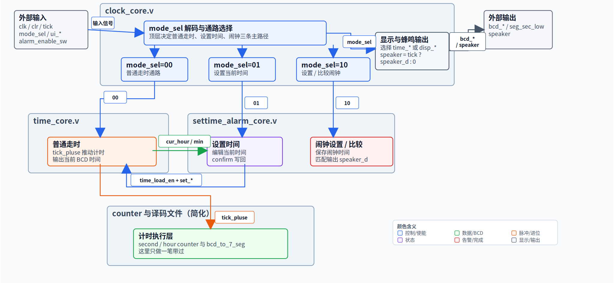
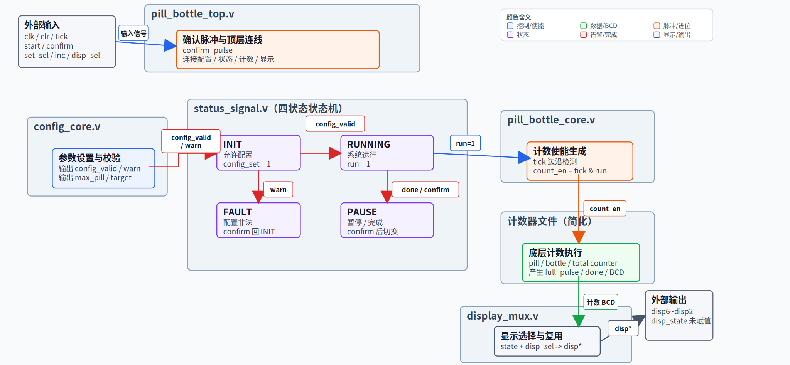

# 2026 春 BUPT 数字逻辑课程设计

这是北京邮电大学 2026 年春季《数字逻辑与数字系统》课程设计项目仓库，包含两个基于 Verilog 的数字系统：数字电子钟和药片装瓶系统。项目面向 TEC-8 / Altera EPM7128SLC84-15 实验平台，使用 Quartus II 建立工程、完成编译并进行上板验证。

## 小组成员

<table>
  <tr>
    <td align="center">
      <a href="https://github.com/TeaSings">
        
        <br />
        <sub><b>陈同学</b></sub>
      </a>
    </td>
    <td align="center">
      <a href="https://github.com/Macixel">
        
        <br />
        <sub><b>刘同学</b></sub>
      </a>
    </td>
    <td align="center">
      <a href="https://github.com/Errormecium">
        
        <br />
        <sub><b>柯同学</b></sub>
      </a>
    </td>
    <td align="center">
      <a href="https://github.com/Xuanx-7">
        
        <br />
        <sub><b>李同学</b></sub>
      </a>
    </td>
  </tr>
</table>

## 项目

### MyClock：数字电子钟系统

课程要求覆盖时/分/秒显示、时钟计数、复位与校时，并鼓励在资源约束下加入扩展功能。

当前实现：

- `clock_core.v`：顶层调度普通走时、时间设置、闹钟设置和显示输出。
- `time_core.v`：维护当前时间，连接秒、分、时 BCD 计数。
- `second_counter.v` / `hour_counter.v`：完成 00-59 与 00-23 计数。
- `settime_alarm_core.v`：处理模式切换、设置写回、闹钟时间保存、匹配响铃和编辑位提示。
- `bcd_to_7_seg.v`：七段数码管译码。



### TabletBottlingSystem：药片装瓶系统

课程要求覆盖药片计数、装瓶控制、顺序流程、稳定运行状态，并鼓励加入异常检测、误操作防护、瓶满检测与报警提示。

当前实现：

- `pill_bottle_top.v`：顶层接口和模块连接。
- `config_core.v`：设置单瓶药片数、目标瓶数，并输出配置有效/警告状态。
- `status_signal.v`：实现 `INIT`、`RUNNING`、`PAUSE`、`FAULT` 四状态控制。
- `pill_counter.v` / `bottle_counter.v`：统计当前瓶药片数与已完成瓶数。
- `total_pills2.v`：统计累计投放药片数。
- `display_mux.v`：按状态和显示选择输出配置、实时计数或总数。



## 目录

```text
MyClock/
├── src/             # 当前 Verilog 源码
├── quartus/         # Quartus 工程入口
└── vhdl_reference/  # VHDL 参考实现

TabletBottlingSystem/
├── src/             # 当前 Verilog 源码
├── quartus/         # Quartus 工程入口
└── vhdl_reference/  # VHDL 参考实现
```

## 工程入口

- 电子钟：`MyClock/quartus/clock_core.qpf`
- 药片装瓶系统：`TabletBottlingSystem/quartus/pill_bottle_top.qpf`
